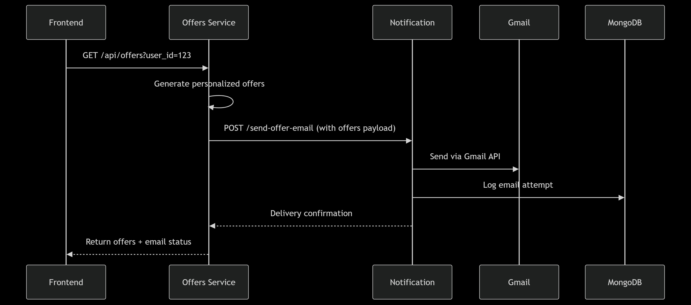

# Team 4- Forex CRM

---
### Shusrith S - PES1UG22AM155
### Siddhi Zanwar - PES1UG22AM161
### Smera Arun Setty - PES1UG22AM922
### Sourabh R Kakrannaya - PES1UG22AM164

---

#### GitHub Repository Link:
https://github.com/s-grade-achievers/forex-crm

---

## System Overview

The Forex CRM system is a cloud-native application composed of microservices that handle:

- Currency exchange transactions
    
- User wallet management
    
- Loyalty point system
    
- Personalized offers
    
- Administrative functions

---

## Architecture

---

## Core Microservices

### 1. Forex Client (React + Node.js)
    
- **Port**: 3001 (frontend), 4000 (backend)
    
- **Features**:
    
    - JWT authentication
        
    - Currency exchange transactions
        
    - Wallet management
        
    - Payment gateway integration
        

### 2. Forex Admin (Node.js)
    
- **Port**: 3000
    
- **Features**:
    
    - Forex reserve management
        
    - Transaction ledger
        
    - Secure HTTPS communication
        
    - JWT-signed transactions
        

### 3. Loyalty Service (Python/FastAPI)
    
- **Port**: 8001
    
- **Features**:
    
    - Wallet point management
        
    - Voucher redemption
        
    - Points accrual system
        

### 4. Offers Service (Python/FastAPI)
    
- **Port**: 8000
    
- **Features**:
    
    - Personalized offer generation
        
    - Festival trend analysis
        
    - User activity tracking
        

---

## Service Integrations

### Authentication Flow

1. Client obtains JWT token from backend
    
2. Token passed in Authorization header for subsequent requests
    
3. Admin services use signed JWTs for high-security operations
    

### Currency Exchange Process

### Loyalty Integration

- Backend calls Loyalty Service at `LOYALTY_SERVICE_HOST:8001`
    
- Endpoints:
    
    - `GET /api/wallet/{user_id}` - Check balance
        
    - `POST /api/wallet/{user_id}/add` - Add points
        

### Offers Integration
    
- Personalized offers based on:
    
    - User activity patterns
        
    - Festival trends
        
    - Traffic analysis
        

---

## Cloud Deployment (Kubernetes)

### Key Components

- **Ingress**: Nginx with TLS termination
    
- **Services**: ClusterIP for internal communication
    
- **Secrets**: JWT, database credentials
    
- **PVCs**: Persistent storage for databases

---

## Development Setup
Services will be available at:

- Forex Client [https://api.forex-crm.local/client](https://api.forex-crm.local/)
    
- Forex Admin: [https://api.forex-crm.local/admin](https://api.forex-crm.local/)
    
- Loyalty: [https://api.forex-crm.local/wallet](https://api.forex-crm.local/)
    
- Offers: [https://api.forex-crm.local/offers](https://api.forex-crm.local/)

---

## Core Integration Patterns

| Integration Type  | Technology             | Services Involved   | Description                           |
| ----------------- | ---------------------- | ------------------- | ------------------------------------- |
| Asynchronous HTTP | FAST APIs              | All services        | Primary communication method          |
| Database Sharing  | PostgreSQL             | Forex-Admin, Client | Shared transactional data             |
| Database Sharing  | SQLite                 | Loyalty, Offers     | Shared loyalty points data            |
| Service Discovery | Kubernetes DNS         | All services        | Internal resolution via service names |
| Security          | JWT Tokens and TLS/SSL | All services        | Cross-service authentication          |

---

## Homestay Management Service Integration (with Loyalty Microservice)

### Integration Architecture

| Feature           | Trigger           | Services Involved        | Data Exchange           |
| ----------------- | ----------------- | ------------------------ | ----------------------- |
| New Booking       | POST /bookings    | Booking → Room → Loyalty | Room ID, Dates, User ID |
| Booking Update    | PUT /bookings/:id | Booking ↔ Room ↔ Loyalty | Status, Points          |
| Points Redemption | POST /use-points  | Booking → Loyalty        | Points Amount           |

### Integration Endpoint

#### Points Accrual (Homestay → Loyalty)

**Endpoint**: `POST /api/wallets/{user_id}/add`  
**Trigger**: Successful homestay booking completion

**Key Integration Files**:

1. `loyalty/main.py` - Endpoint definitions
    
2. `loyalty/app/crud.py` - Database operations
    
3. `loyalty/app/models.py` - Wallet schema
    
4. `loyalty/app/schemas.py` - Pydantic models

---

## Notification Service Integration (With Offers Microservice)

#### Personalized Offers Email

**Trigger**: Offer generation service  
**Endpoint**: `POST /send-offer-email`

### Integration Architecture

### Key Integration Files

#### 1. Offer Generation Core (`offers/core/`)

|File|Purpose|Integration Point|
|---|---|---|
|`offer_generator.py`|Creates offer objects|Formats data for email template|
|`rule_engine.py`|Applies business rules|Determines which offers trigger notifications|

#### 2. Service Layer (`offers/services/`)

|File|Data Source|Notification Trigger|
|---|---|---|
|`user_activity_service.py`|User booking history|High-value customer flag|
|`festival_trend_service.py`|Calendar events|Seasonal promotion offers|
|`traffic_analyzer.py`|Destination popularity|Limited-time deals|

---
